# MSA-Playground

이 저장소는 **마이크로 서비스 패턴** 책을 읽고 작성하는 곳이다. 

---

## Food To Go (FTGO)

2005년 후반 설립된 미국 온라인 음식 배달 회사  
자바/ 하나의 WAR 파일로 구성된 모놀리스 개발,

### FTGO Application Architecture


논리적으로는 모듈화한 아키텍쳐임에도 애플리케이션은 WAR 하나로 패키징  
그렇다면 모놀리식은 나쁜 건가 ?

#### 모놀리식 아키텍쳐의 장점
모놀리식이 나쁜 건 아니다, 충분히 좋다.

1. **개발이 간단하다** : IDE 등 개발 툴 들은 단일 애플리케이션 구축에 초점이 맞추어져 있다.
2. **애플리케이션 변경이 쉽다** : 코드, DB 스키마 등을 하나만 변경해서 빌드/배포하기 용이하다.
3. **테스트가 용이하다** : 어플리케이션을 띄우고, API 호출하고, UI 테스트 하며, 종단 간 테스트를 하면 된다.  
4. **배포가 쉽다** : 한 곳에서만 올리면 된다.  
5. **확장이 쉽다** : 애플리케이션 인스턴스를 여러 개 실행하면 된다.

그런데, 시나브로 개발/테스트/배포/확장은 소모성 회의는 많아지고, 애자일 방법론도 도입해보았지만 개발 속도는 점점 더 더뎌진다.

### WHY ?

#### 1. 모놀리식의 근본적 한계

스프린트를 진행해 나갈수록 추가 구현할 스토리가 늘어갔고, 그만큼 코드베이스와 관리 오버헤드는 점점 더 증가.  
점점 더 인원은 늘어나겠죠.  

한 때는 조그마했던 어플리케이션은 수년간 계속 몸집이 커지고, 거대하게 바뀌었고 소규모였던 개발 팀도 이제는 거대해지고 분야가 나뉘어진다.  
아키텍처가 몸에 맞지 않게 되니 FTGO 는 모놀리식 지옥에 빠져 지금은 애자일식 개발/배포도 어려워짐.  
왜 그럴까 ?

##### 2. 너무 복잡해서 개발자가 주눅든다.

거대해진 모놀리식 애플리케이션은 일단 **너무 복잡**하다.  
여느 개발자가 완전히 이해할 수 없을 정도로 내용이 방대해서 버그를 고치는 것조차 어려워지고, 새 기능을 정확하게 구현하기가 갈수록 힘들고 시간도 오래 걸린다.  
마감일자 놓치기는 덤.  
개발하면서, 변경이 될 때마다 코드베이스는 한층 더복잡해지고 난해한 코드로 뒤덮이게 된다.  

##### 3. 개발이 더디다

복잡도와 싸우는 것과는 별개로 개발자의 일상마저 더뎌지게 된다.  
애플리케이션이 너무 거대해 IDE 속도는 느려지고, 빌드 시간도 오래걸리게 된다.  
코드를 수정하고 빌드/실행 후 테스트까지 너무 많은 시간이 소요된다.  

##### 4. 커밋부터 배포에 이르는 길고 험난한 여정  

고친 내용을 실서버/프로덕션에 배포하는 일이 아주 길고 고통스러워진다.  
여러 코드가 한 곳에 몰리다 보니 테스트도 어려워 지고 릴리스 자체가 어려워 지기도 하죠.  
**feature branch** 로 이 문제가 해결되나 싶었지만 결국 고통스러운 **rebase/merge** 작업이 새로 나오게 되었죠.  

##### 5. 확장하기 어렵다.

##### 6. 확실한 전달이 어렵다

애플리케이션 자체가 너무 크다보니 철저하게 테스트하기가 어려워지고, 이로 인해 버그 발생률이 올라가며, 신뢰성이 떨어지게 된다.  
전체 모듈이 하나의 프로세스로 실행되는 까닭에 결함이 서로 격리 (Fault Isolation) 되지 않고 그러다 보니 버그가 하나만 있어도 전체 애플리케이션에 영향을 주는 케이스가 생기죠.  
이거는 매출고 직결되어 경영진의 신뢰도와도 연결되죠.  

##### 7. 갈수록 한물간 기술 스택에 발목이 붙잡히다.  

끝으로, 모놀리식 지옥은 거대하고 고착화된 아키텍쳐로 인해서 점점 한물간 기술스택이 되어진다.  
**"특성상", "이렇다보니", "어쩔 수 없이", "일단은", "무서우니까"** 
규모가 큰 팀이면, 커지는 팀이라면 여러 사람이 모놀리식 애플리케이션 하나에 달라붙어 작업할 때 일어나는 어쩔 수 없는 일들이다.  
팀 차원에서 필연적으로 일어날 일들을 조금 늦추는 일 외에는 방법이 없다.  
이 지옥을 탈출하는 방법은 마이크로서비스 아키텍쳐의 문을 여는 방법밖에 없다.  

### 확장 큐브와 마이크로 서비스

**확장 큐브**
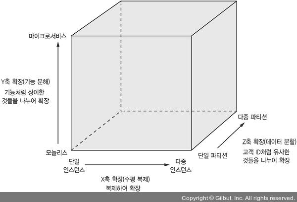

#### X축 확장 : 다중 인스턴스에 고루 요청 분산

일반적인 모놀리식 애플리케이션의 확장 수단  
부하 분산기를 두고 부하 분산기 뒷면에 애플리케이션 인스턴스를 N개 띄워 놓고 들어온 요청을 이들 인스턴스에 고루 분배한다.  
애플리케이션 능력과 가용성을 개선할 수 있는 훌륭한 방법

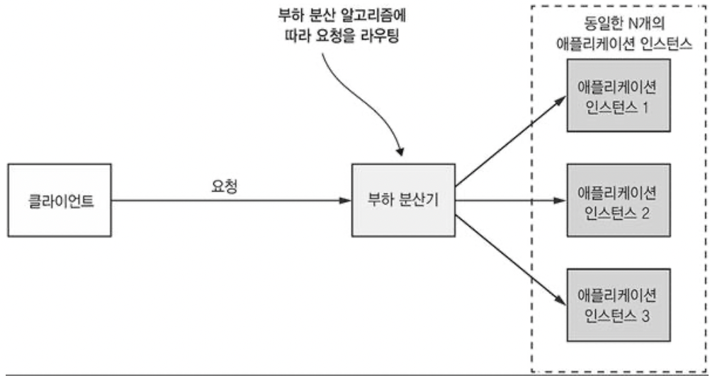  

#### Z축 확장 : 요청 속성별 라우팅

인스턴스별로 주어진 데이터 하위집합 (subset) 만 처리하도록 설정하는 방법.  
인스턴스 앞면에 위치한 라우터는 요청의 속성에 알맞은 인스턴스로 요청을 라우팅 (e.g. UserId 에 따라)  

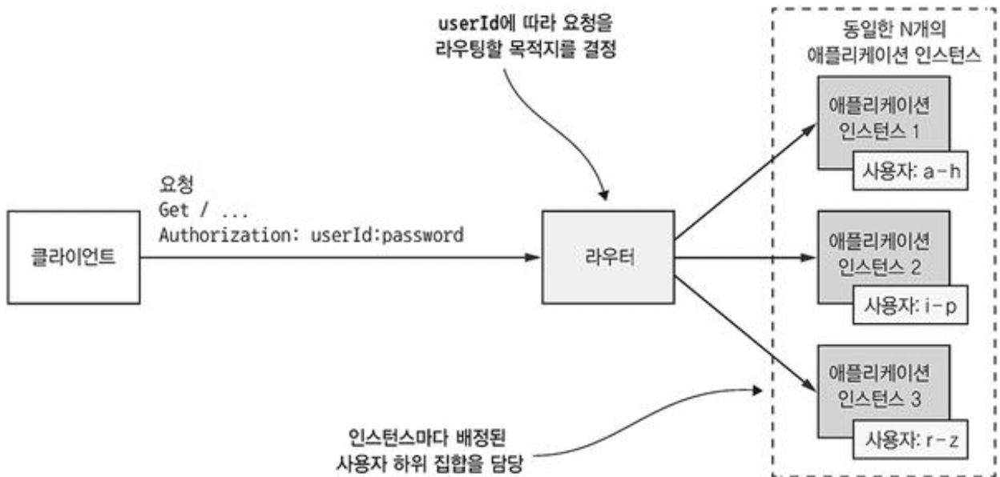

그림에서 인스턴스는 자신에게 배정된 사용자 하위 집합만 처리한다.  
라우터는 요청 헤더 *Authorization* 에 포함된 *userId* 를 보고 N개의 동일한 애플리케이션 인스턴스 중 하나를 선택.  
Z 축 확장은 애플리케이션을 확장해서 중가하는 트랜잭션 및 데이터 볼륨을 처리하기 좋은 수단  

#### Y축 확장 : 기능에 따라 어플리케이션을 서비스로 분해  

X축/Z축 확장을 하면 애플리케이션 능력 및 가용성은 개선되나, 애플리케이션이 점점 복잡해지는 문제는 해결되지 않는다.  
따라서, 기능분해가 필요하다.  
모놀리식 애플리케이션을 여러 **서비스**로 쪼개는 것이다.  

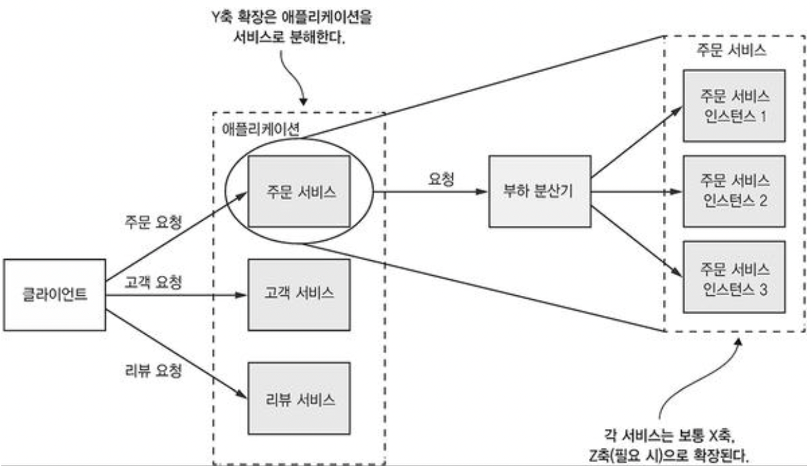

서비스는 주문관리, 고객관리, 리뷰등 지엽적 기능이 구현된 미니 애플리케이션이다.  

마이크로 서비스 아키텍쳐는 고수준에서 바라보면 하나의 애플리케이션을 여러 서비스로 기능분해하는 아키텍쳐 스타일이다.  
여기서 중요한 것은 **크기**가 아니라, 각 서비스가 **집중된(focused) / 응집된 (cohesive) 책임**을 맡고 있다는 사실이다. 

### 모듈성

크고 복잡한 애플리케이션을 개발할 때 꼭 필요한 특성  
최근 애플리케이션은 규모가 방대하고, 복잡하여 어느 한 개인이 전부 다 이해하고 개발할 수 없음  
고로, 여러 사람이 이해할 수 있어야 하고, 개발할 수 있게 애플리케이션을 모듈로 분해하여야 한다.  
마이크로 서비스 아키텍처는 서비스를 **모듈성의 단위**로 사용  
각 서비스는 다른 서비스가 함부로 규칙을 어기거나 침투하거나, 내부를 알 필요없게 API 라는 경계선을 지니고 있어, 다른 서비스 API를 위회하여 그 내부 클래스에 마음대로 들어올 수 없게 한다.  
따라서, 시간이 지나도 애플리케이션 모듈성을 유지하기가 훨씬 수월해지고, 서비스를 빌딩 블록 처럼 사용해 독립적으로 배포/확장 할 수 있는 부가적 장점도 있음.  

### 서비스 마다 DB 를 따로

마이크로 서비스는 서로 굉장히 **느슨하게** 연결되어 있고, 오직 API 를 통해서만 통신한다.  
느슨하게 연결돼있다 함은, 식당에서 요리를 주문하는 것과 같음.  
그저 주문만 하면 되지, 요리가 어떻게 만들어지는지, 어떤 재료를 가지고 있는지는 알 필요가 없다.  
같은 업계의 다른 요리사가 오더라도,  
이 말을 서비스로 다시 돌아와 얘기하면, 요리/재료 들은 ? DB 가 된다.  
각각 자체 DB를 갖고 있어서, 주문하는 고객이, 즉, 다른 모듈이 사용하려는 모듈과 일일이 협의 하지 않고 모듈 자신만의 스키마를 가지고, 변경할 수 있다.  
이로 인해 다른 서비스가 DB Lock 을 획득해서 내 서비스를 블로킹하는 일이 존재하지 않음.

- [ ] 그렇다면 RDBMS 구매 비용이 서비스(모듈) 갯수만큼 늘어나 ? 2장에서 확인

### FTGO Microservice Architecture

#### Y축 확장의 결과
- 주문서비스 : 주문을 관리
- 배달 서비스 : 음식점에서 소비자에 이르기까지 주문 배달을 관리
- 음식점 서비스 : 음식점 관련 정보를 관리  
- 주방 서비스 : 주문한 음식을 준비하는 과정을 관리
- 화계 서비스 : 과금/지불을 관리  

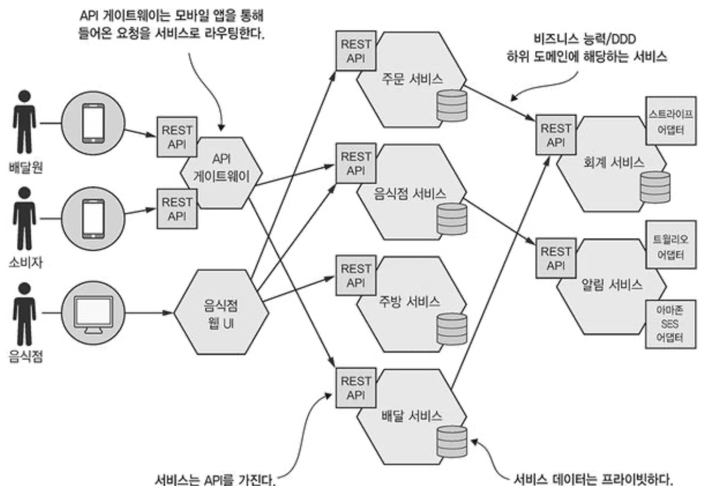

서비스와 API 가 분명하게 분리돼 정의된 것만 다를 뿐, 앞선 모놀리식과 정확하게 대응 된다.  
각 서비스를 **독립적으로** 개발, 테스트, 배포, 확장가능하며 개발자가 타 서비스의 API 를 우회하거나 그 내부요소에 직접 접근할 수 없어 모듈성 유지 차원에서도 적합

### 장점

#### 크고 복잡한 애플케이션을 지속적으로 전달/배포할 수 있다.  
MSA 는 다음 세가지 방법으로 지속적 전달/배포 (CD) 를 실현  
1. 테스트성 : 자동화 테스트가 필수, MSA 는 상대적으로 크기가 작아 자동화 테스트 작성이 쉽고 빠름  
2. 배포성 : 독립적으로 배포가 가능해, 굳이 다른 서비스의 개발자와 협의가 필요 없음.
3. 자율성/느슨한 결합 : 작은 팀이 여러 기술이 결합된 조직을 꾸릴 수 있음. 팀별로 하나 이상의 관련 서비스를 개발/배포 하는 업무를 담당. 다른 팀과 독립적으로 개발/배포/확장 가능  

CD 를 할 경우 비즈니스적 장점  
1. 제품이 시장에 내놓는 속도가 빨라지고, 피드백 반영속도가 빨라짐.  
2. 고객의 원하는 수준으로 확실하게 서비스 제공 가능
3. 개발자가 급한 불을 끄느라 에너지를 낭비하는 대신 제품의 가치를 전달하는 데 더 많은 시간 투자 가능  

#### 서비스가 작아 관리가 용이  

#### 독립적 배포/확장 가능

#### 결함 격리(Fault Isolation)가 잘됨

다른 서비스에서 메모리 누수가 발생해도, 해당 서비스에만 영향이 가고 다른 서비스는 계속 정상 가동 됨.  
모놀리식은 한곳이 고장나면 전체 시스템이 곤경에 빠짐  

#### 신기술 시험/도입이 쉽다.  

빼놓을 수 없는 장점으로 특정 기술 스택을 연구/도입 할 때 오랜 시간이 필요 없고, 그 서비스에 맞는 언어와 프레임워크를 자유롭게 선택 가능  
가령, 카모아에서 차량리스트는 안정성보다는 속도, 결제는 속도보다는 안정성인 경우가 될 텐데 이에 맞는 언어/DB 선택이 가능해진다.  

### 단점

#### 잘 맞는 서비스 찾기가 쉽지 않다.

MSA 에 맞게 시스템을 여러 서비스로 분해하는, 정확한 알고리즘은 없다.  
그래서 잘못 모듈화 한경우, 모놀리식과 마이크로 서비스 아키텍쳐의 단점만 존재하는 분산 모놀리스를 구축하게 됨.  

#### 분산 시스템은 복잡하다.  

분산 시스템이라는 또 다른 복잡성은 개발자가 감내해야 한다.  
서비스간 통신에서 단순 메소드 호출보다는 복잡하게 되고, 사용 불가/부분 실패와 같은 서비스를 처리할 수 있게 설계해야 함.  
또 단순 쿼리 (모듈만의 쿼리)로는 여러 서비스에 있는 데이터 조회가 어려워 API 를 조합하거나 CQRS View 로 처리가 필요  

또한, 여러 서비스가 여러 인스턴스로 띄어져 있다보니 프로덕션에서 관리해야 할 가동부가 늘어나게 됨.  
이를 해결하기 위해 여러 플랫폼들이 존재, 대표적인 예로 가장 익숙한것이 Kubernetes  

#### 여러 서비스에 걸친 공통 기능은 배포할 경우 세심하게 봐야 함

여러 서비스에 걸친 기능을 배포할 때에는 여러 개발 팀 간에 세심한 조율이 필요한 경우가 있음.  
서비스 간 디펜던시에 따라 서비스 배포 계획을 빈틈없이 수립해야 함.  

#### 도입 시기 결정의 어려움

## 소프트웨어 아키텍처의 정의와 중요성

### 소프트웨어 아키텍처의 정의

> 컴퓨터 시스템의 소프트웨어 아키텍처는 소프트웨어 엘리먼트와 그들 간의 관계, 그리고 이 둘의 속성으로 구성된 시스템을 추론하는데 필요한 구조의 집합
>
> <소프트웨어 아키텍처 문서화>, <바스> 등...

애플리케이션 아키텍처가 여러 파트(엘리먼트) 로의 분해와 이런 파트간의 관계라는 것.  
분해가 중요한 이유  
1. 업무와 지식을 분리. 덕분에, 전문 지식을 보유한 사람들(또는 여러 팀)이 함께 생산적으로 애플리케이션 작업을 할 수 있다.
2. 소프트웨어 엘리먼트가 어떻게 상호작용하는지 밝힌다.  

### 소프트웨어 아키텍처의 4+1 View Model

4+1 모델은 소프트웨어 아키텍처를 바라보는 상이한 4 View 를 정의한다.  
각 뷰는 아키텍처의 특정한 측면을 기술하고 특정 소프트웨어 엘리먼트와 그들 사이의 관계로 구성된다.  

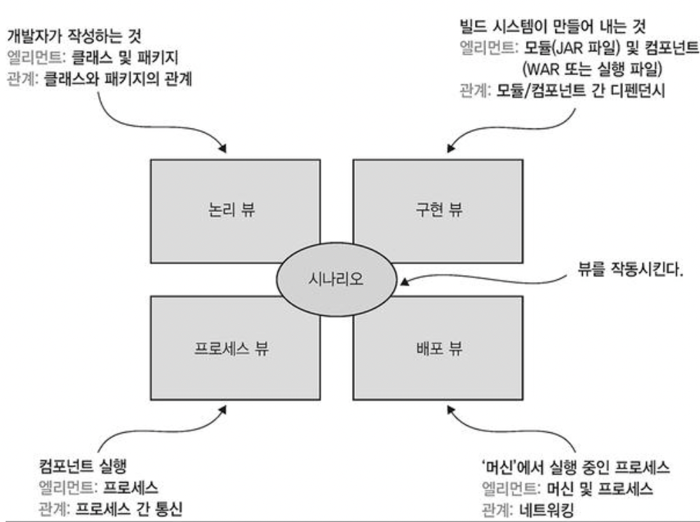

* 논리 뷰 : 개발자가 작성한 소프트웨어 엘리먼트, 객체 지향 언어라면 클래스, 패키지가 해당되며 결국 상속, 연관 (association), 의존 (depends-on) 등 클래스와 패키지의 관계를 말한다.  
* 구현 뷰 (Implement/Development View) : 빌드 시스템의 결과물. 모듈(패키징된 코드)과 컴포넌트로 구성된다. 모듈 간 디펜던시와 컴포넌트/모듈 간 조합 관계도 이 뷰에 포함된다.  
* 프로세스 뷰 : 런타임 컴포넌트. 각 엘리먼트는 개별 프로세스고, IPC는 프로세스 간 관계를 나타낸다.  
* 배포 뷰 : 프로세스 가 머신에 매핑되는 방법. 이 뷰의 엘리먼트는 머신 및 프로세스고, 머신 간의 관계가 바로 네트워킹. 프로세스와 머신 사이의 관계도 이 뷰에서 기술된다.

4 View 외에도 뷰를 구동 시키는 시나리오가 있다.  
각 시나리오는 특정 뷰 내에서 얼마나 다양한 아키텍처 요소가 협동하여 요청을 처리하는지 기술.  
4 View 는 중요한 아키텍처 측면을, 시나리오는 뷰의 여러 엘리먼트가 협동하는 과정을 명시

### 아키텍쳐의 중요성

애플리케이션 요건은 크게 두 가지 종류로 나뉜다.

1. 애플리케이션이 해야 할 일을 정의한 기능요건
2. `~성` 으로 끝나는 서비스 품질 요건.

보통 유즈케이스나 사용자 스토리 포맷으로 기능요건을 기술하는데, 이 기능요건과 아키텍쳐는 거의 무관하다.  
아키텍쳐는 서비스 품질 요건을 충족시킬 수 있게 설계해야 하므로 아주 중요하다.  
확장성, 신뢰성과 같은 런타임 품질 외에도 관리성, 테스트성, 배포성처럼 개발 시점의 품질도 해당된다.  
애플리케이션 아키텍쳐를 어떻게 선택하느냐에 따라 이런 품질 요건을 얼마나 충족시킬 수 있는지 결정.

### 계층화 아키텍처

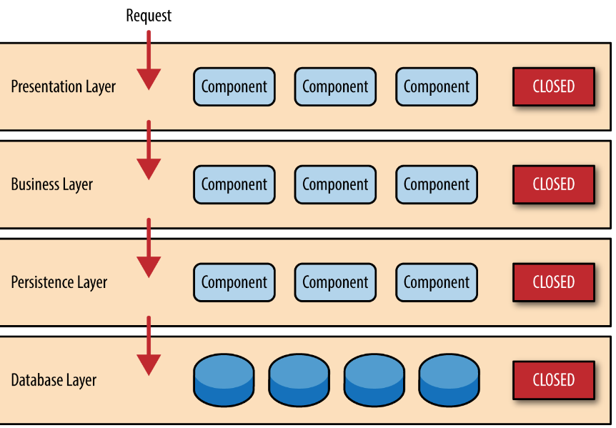

전형적인 아키텍쳐 스타일로, 계층마다 명확히 정의된 역할을 분담하며 계층 간 디펜던시는 이카틱체려 재현한다.  
따라서, 어떤 계층은 바로 하위에 있는 계층에만 의존하거나, 하위에 위치한 어느 한 계층에 의존한다.  

* 표현 계층/Presentation : 사용자 인테퍼이스 혹은 외부 API가 구현된 계층
* 비즈니스 로직 계층 : 비즈니스 로직이 구현된 계층
* 영속화 계층/Persistence : DB 상호작용이 구현된 계층

하지만, 이 아키텍쳐에는 몇 가지 중요한 흠이 있다.  

1. 표현 계층이 하나 뿐이다 : 애플리케이션을 호출하는 시스템이 하나벆에 없을까 ?
2. 영속화 계층이 하나 뿐이다 : 애필르케이션이 상호작용하는 DB 가 하나뿐일가 ? 
3. 비즈니스 로직계층을 영속화 계층에 의존하는 형태로 정의한다 : 이론적으로 이런 Dependency 때문에 DB 업이 비즈니스 로직을 테스트하는 것이 불가능하다.  

이러한 문제점을 해결하고자 육각형 아키텍쳐가 고안되었다.

### 육각형 아키텍쳐

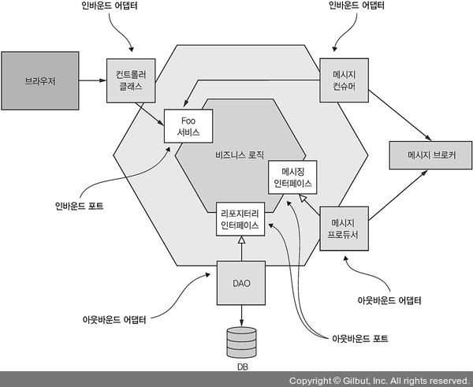

논리 뷰를 비즈니스 로직 중심으로 구성하는 계층화 아키텍처 스타일의 대안  
애플리케이션에 표현 계층 대신 비즈니스 로직을 호출하여 외부에서 들어온 요청을 처리하는 인바운더 어댑터(들)와  
영속화 계층 대신 비즈니스 로직에 의해 호출되고 외부 애플리케이션을 호출하느 아웃바운드 어댑터(들)를 둔다.  
비즈니스 로직이 어댑터에 전혀 의존하지 않는 것이 가장 중요한 특징이며, 외려 어댑터가 비즈니스 로직에 의존한다.

비즈니스 로직에는 하나 이상의 포트가 있다. 포트는 비즈니스 로직이 자신의 외부 세계와 상호 작용하는 방법이 정의된 작업.  
포트 종류는 인바운드/아웃바운드 두 가지이며, 인바운드 포트는 비즈니스 로직이 표출된 API로서, 외부 애플리케이션은 이 API를 ㅌ오해 비즈니스 로직을 호출한다.  
아웃바운드 포트는 비즈니스 로직이 외부 시스템을 호출하는 방법에 관한 것이다.

어댑터는 비즈니스 로직 주변을 감싸고 있다. 엔드포인트라고 생각하면 됨.

육각형 아키텍처 스타일의 가장 큰 장점은 비즈니스 로직에 있던 표현/데이터 접근 로직이 어뎁터와 분리되었기 때문에 비즈니스 로직이 표현/데이터 접근 로직 어디에도 의존하지 않는다는 점이다.  

포트 : 접근하기 위한 **인터페이스 클래스**

## 마이크로서비스 아키텍쳐는 일종의 아키텍쳐 스타일

애플리케이션을 느슨하게 결합된, 독립적으로 배포 가능한 여러 서비스로 구성한다.  

### 서비스란 무엇인가 ?

서비스는 어떤 기능이 구현되어 단독 배포가 가능한 소프트웨어 컴포넌트이다.  
서비스는 클라이언트가 자신이 서비스하는 기능에 접근할 수 있도록 Command, Query, Event 로 구성된 API를 제공한다.  

서비스 API는 내부 구현 상세를 캡슐화한다.  
모놀리스와 달리 개발자는 API를 우회하여 서비스에 접근할수 없고, 마이크로서비스 아키텍쳐에서 애플리케이션 모듈성은 보장된다.  
각각의 마이크로서비스는 자체 아키텍쳐를 갖고 있기 때문에 기술 스택을 독자적으로 구축할 수 있지만 대부분 육각형 아키텍쳐 형태를 취한다.  

### 느슨한 결합

**느슨하게 결합된 서비스**는 마이크로서비스 아키텍처의 주요 특성 중 하나이다.  
서비스는 구현 코드를 감싼 API를 통해서만 상호작용하므로 클라이언트에 영향을 끼치지 않고 서비스 내부구현 코드를 바꿀 수 있다.  
느슨하게 결합된 서비스는 유지보수성, 테스트성을 높이고 애플리케이션 개발 시간을 단축하는 효과가 있다.  

--Den--  
느슨한 결합은 서비스간이 아니라 서비스 안에서도 유지되어야 함.  
예를 들어, 함수로 들어온 파라미터는 **절대** 변경하지 않는 것
```javascript
function neverChange(param) {
    const newParam = {
        ...param,
        newKey: "value"
    };
    
    return newParam;
}
```
--Den End--

### 공유 라이브러리의 역할

코드 중복을 방지하기 위해 여러 애플리케이션에 재사용 가능한 기능을 라이브러리(모듈)로 패키징하는 것은 당연한 일이다.  
그래서 마이크로서비스 아키텍처에서도 공유 라이브러리 (shared library)를 만들고픈 유혹에 빠지기 쉽지만, 의도치 않은 결합도를 유발하지 않도록 주의해야 한다.  
예를 들어, Order 비즈니스 객체를 공유라이브러리도 빼면 요건이 변경될 경우 모든 서비스에 영향이 가게 된다.  

물론, 바뀔 일이 거의 없는 기능은 라이브러리에 담아 쓰는 것이 좋다. Money 와 같은 서비스 말이다.

### 서비스 규모는 상관없다.

왠지 "마이크로" 라고 하니까 작게 만들어야 할 것 같은데, 크기가 중요한 것은 아니다.  
크기보다는 작은 팀이 가장 짧은 시간에 다른 팀과 협동하는 부분은 최소로 하여 개발 가능한 서비스를 설계해야 한다.  

## 마이크로서비스 아키텍쳐 정의

어떻게 정의해야 할까 ? 사실 아키텍쳐를 정의하는 일은 과학보다는 예술에 가깝다.  
애플리케이션 아키텍쳐를 정의하는 3단계 프로세스를 설명하려고 한다.  
기계적으로 따라할 수 있는 과정은 아니고, 창의성이 필요해진다.  

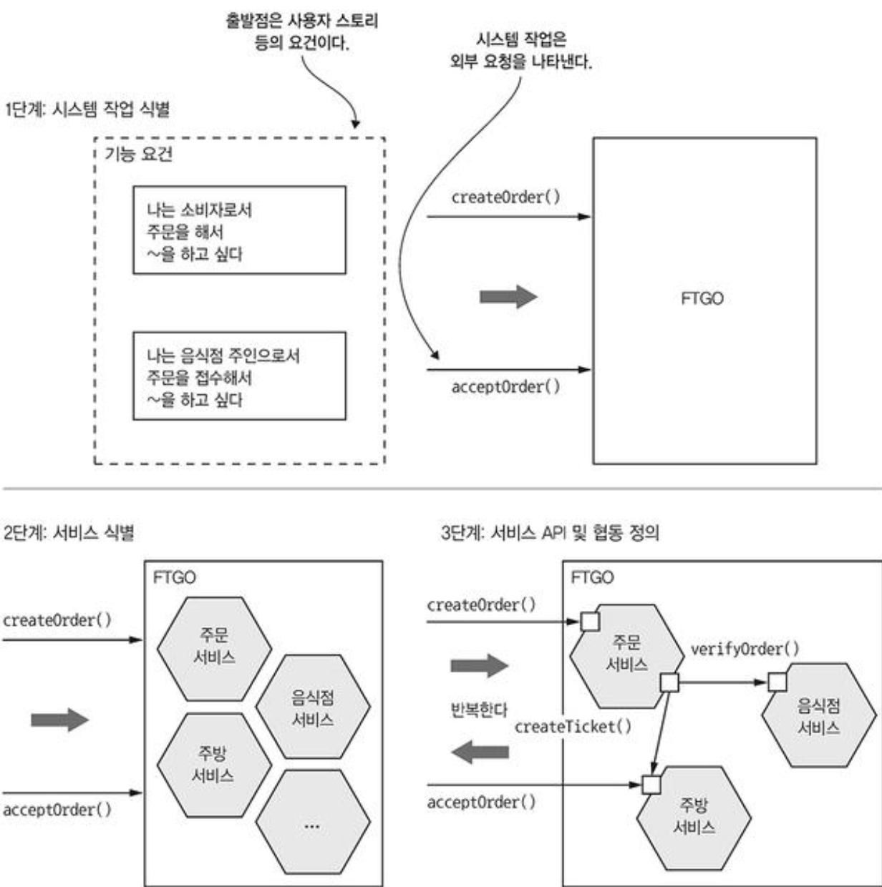

애플리케이션은 사용자의 요청을 처리하기 위해 존재한다.  
따라서 아키텍처를 정의하는 1단계는 **애플리케이션 요건을 핵심 요청으로 추출하는 것**이다. 
데이터를 업데이트하는 커맨드나 데이터를 조회하는 쿼리는 애플리케이션이 처리하는 요청을 추상화한것이다.  
결국 시스템 작업은 여러 서비스가 서로 협동하는 방식을 표현한 아키텍처 시나리오가 된다.  

2단계는 **어떻게 여러 서비스로 분해할지 결정하는 것**이다.  
여러가지 전략을 선택할 수 있는데, 비즈니스 아키텍처 시각에서 비즈니스 능력에 따라 서비스를 정의할 수도 있고, DDD의 하위 도메인별로 서비스를 구성하는 전략도 가능하다.  
어떤 전략을 구사하든 최종 결과는 기술 개념이 아닌 비즈니스 개념 중심으로 이루어진 서비스들이다.  

3단계는 **서비스별로 API를 정의하는 일**이다.  
이를 위해 먼저 1단계에서 식별된 시스템 작업을 각 서비스에 배정해야 한다.  
완전히 독립된 서비스도 있겠지만, 다른 서비스와 협동할 수 밖에 없는 작업이 구현된 서비스도 있다.  
이 때, 여러 서비스가 협동하는 방식을 결정해야 하는데, 대부분 서비스에 추가 지원 작업을 두는 형태가 된다.  
API 구현시 IPC도 정해야 한다.  

```
IPC ?

프로세스 간 통신(Inter-Process Communication)을 의미하며, 프로세스들 사이에 서로 데이터를 주고 받는 방법이나 경로를 뜻함.
```

분해과정에는 장애물이 많다.  
1. 네트워크 지연
2. 서비스 간 동기 통신으로 인해 가용성이 떨어지는 문제
3. 여러 서비스에 걸쳐 데이터 일관성을 지키는 요건
4. 도처에 숨어 있는 만능 클래스

## 시스템 작업 식별

애플리케이션 아키텍처를 정의하는 첫 단추는 시스템 작업을 정의하는 일이다.  
그 출발점은 사요자 스토리와 이와 연관된 사용자 시나리오(아키텍처 시나리오가 아닌) 등의 애플리케이션 요건이다.  
1단계로, 시스템 작업을 기술하기 위해 필요한 보케블러리를 제공하는 핵심 클래스로 구성된 고수준의 도메인 모델을 생성하는 것.  
2단계는 시스템 작업 식별 후 그 동작을 도메인 모델 관점에서 기술하는 것.  

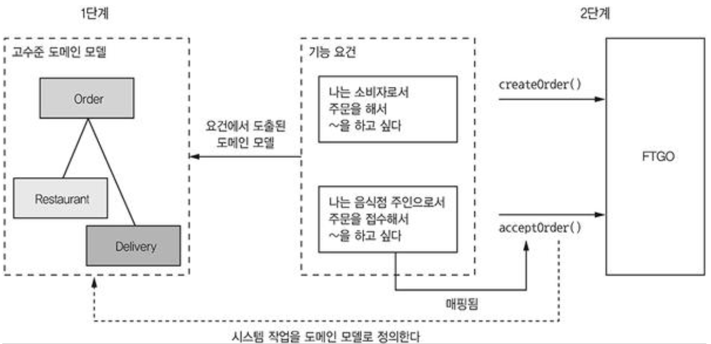

도메인 모델은 주로 사용자 스토리의 명사에서 도출한다.  
시스템 작업은 주로 동사에서 도출하며, 각각 하나 이상의 도메인 객체와 그들간의 관계로 기술한다. 도메인 모델을 생성, 수정, 삭제 하거나 모델간 관계를 맺고 끊을 수 있다.

### 고수준 도메인 모델 생성

시스템 작업을 정의하려면 우선 고수준의 애플리케이션 모델을 대략 그려본다.  
도메인 모델은 스토리에 포함된 명사를 분석하고 도메인 전문가와 상담하는 등 표준 기법을 활용하여 생성한다.  
예를 들어, "주문하기" 스토리는 다음과 같이 다양한 시용자 시나리오로 확장시킬 수 있다.

```markdown
<Given>
소비자가 있다.  
음식점이 있다.  
음석점은 소비자의 주소로 제시간에 음식을 배달할 수 있다.  
주문 총액이 음식점의 최소 주문량 조건에 부합한다.  

<When>
소비자가 음식점에 음식을 주문한다.  

<Then>
소비자 신용카드가 승인된다.  
주문이 PENDING_ACCEPTANCE 상태로 생성된다.  
생성된 주문이 소비자와 연관된다.  
생성된 주문이 음식점과 연관된다.
```

위 사용자 시나리오에 포함된 명사를 보면 소비자, 주문, 음식점, 신용카드 등 다양한 클래스가 필요할 것 같습니다.  
이번엔 주문 접수 스토리를 봅시다

```markdown
<Given>
현재 주문은 PENDING_ACCEPTANCE 상태다.  
주문 배달 가능한 배달원이 있다.

<When>
주문을 접수한 음식점은 언제까지 음식을 준비할 수 있다고 약속한다.  

<Then>
주문 상태가 ACCEPTED로 변경된다.  
주문의 promiseByTime 값을 음식점이 준비하기로 약속한 시간으로 업데이트 한다.  
주문을 배달할 배달원을 배정한다.
```

위 시나리오를 보니까 배달원, 배달 클래스가 필요할 것 같다.  
이런 것을 몇 차례 거듭하면 메뉴항목, 주소 등 여타 클래스도 도출이 가능하다.  

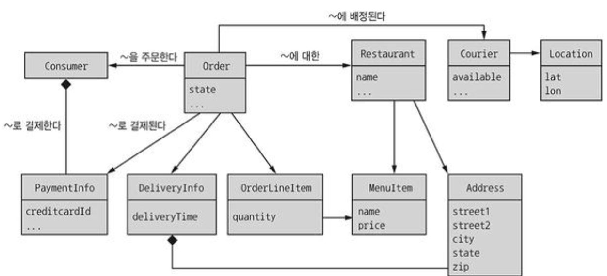

이 다음은 아키텍처 시나리오에 맞게 시스템 작업을 정의할 차례입니다.  

### 시스템 작업 정의

애플리케이션이 어떤 요청을 처리할지 식별하는 단계인데, 사용자 시나리오마다 화면에서 백엔드 비즈니스 로직을 요청하고  
수신한 데이터를 조회/수정하는 UI는 여러분도 이미 익숙할 것이다.  
시스템 작업은 크게 다음 두 종류로 나뉜다.

* Command 와 Query

Command 는 데이터 생성, 수정, 삭제 (CUD) 를 의미하고, 쿼리는 읽기 (R) 을 의미한다.   
[참고) CQS vs CQRS](./CQRS.md) 

커맨드를 식별하려면 사용자 스토리/시나리오에 포함된 동사를 먼저 분석한다.  
예를 들어, 주문하기 스토리를 보면 당연히 주문 생성 작업이 필요하다.  

| **액터**                   | **스토리**   | **커맨드**                   | **설명**                                  |
|--------------------------|-----------|---------------------------|-----------------------------------------|
| **소비자**<br/>(Consumer)   | 주문생성      | createOrder()             | 주문을 생성한다.                               |
| **음식점**<br/>(Restaurant) | 주문접수      | acceptOrder()             | 음식점에 주문이 접수됐고, 주어진 시각까지 음식을 준비하도록 지시한다. |
| **음식점**<br/>(Restaurant) | 주문 픽업 준비됨 | noteOrderReadyForPickup() | 주문한 음식이 픽업 가능함을 알린다.                    |
| **배달원**<br/>(Courier)    | 위치 업데이트   | noteUpdatedLocation()     | 배달원의 현재 위치를 업데이트 한다                     |
| **배달원**<br/>(Courier)   | 배달 픽업     | noteDeliveryPickedUp()    | 주문한 음식을 배달원이 픽업했음을 알린다.                 |
| **배달원**<br/>(Courier)   | 주문 배달됨    | noteDeliveryDelivered()   | 주문한 음식을 배달원이 소비자에게 배달했음을 알린다.           |

커맨드는 매개변수, 반환값, 동작 방식의 명세를 도메인 모델 클래스로 정의한다.  
이 명세는 작업 호출 시 충족되어야 할 선행조건, 작업 호출 후 충족되어야 할 후행 조건으로 구성된다.  
`createOrder()`를 예로 들어, 시스템 작업의 명세를 정의해보자.  

**작업**   
createOrder(소비자 ID, 결제 수단, 배달 주소, 배달 시각, 음식점 ID, 주문 품목)

**반환값**  
orderId, ...

**선행조건**  
- 소비자가 존재하고 주문을 할 수 있다.
- 주문 품목음 음식점의 메뉴 항목에 들어 있다.
- 배달 주소/시각은 음식점에서 서비스 할 수 있다.

**후행조건**
- 소비자 신용카드는 주문 금액만큼 승인 처리 되었다.
- 주문은 PENDING_ACCEPTANCE 상태로 생성되었다.

선행조건은 주문하기 시나리오의 전제(given)를, 후행 조건은 주문하기 시나리오의 결과(then)를 나타낸다.

## 서비스 정의 :  비즈니스 능력 패턴별 분해

MSA 를 구축하는 첫 번째 전략은 비즈니스 능력에 따라 분해하는 것이다.  
비즈니스 아키텍처 모델링에서 비롯된 비즈니스 능력은 비즈니스가 가치를 생산하기 위해 하는 일을 말하고, 업종마다 다르다.  
FTGO 를 기준으로 예를 들면

**공급자 관리**
- 배달원
- 음식점 정보

**소비자 관리**  

**주문 접수 이행**
- 주문 관리
- 음식점 주문 관리
- 배달원 가용성 관리
- 배달 관리

**회계관리**

이렇게 크게 나눌 수 있고 위 능력들을 서비스로 나눌 수 있게 된다.  

## 서비스 정의 : 하위 도메인 패턴별 분해

DDD 는 팀에서 사용할 공용 언어를 정의한다. 도메인 모델은 애플리케이션 설계/구현에 밀접하게 반영된다.  
DDD에는 MSA를 적용하면 정말 유용한 하위 도메인과 bounded context (경계 컨텍스트) 개념이 있다.  

기존에는 전체 비즈니스를 포괄하는 단일 통합 모델을 만들었는데, 예를 들어 소비자, 주문 등의 비즈니스 엔티티를 각각 따로 정의했다.  
이렇게 모델링하면 하나의 모델에 대해 조직 내 여러 부서의 합의를 이끌어내기가 어려운 단점이 있다.

DDD 는 도메인을 구성하는 각 하위 도메인마다 도메인 모델을 따로 정의한다.  
하위 도메인은 비즈니스 능력과 같은 방법으로 식별하므로 십중팔구 비즈니스 능력과 유사한 하위 도메인이 도출된다.  

도메인 모델의 범위를 DDD 용어로는 경계 컨텍스트라고 한다.  

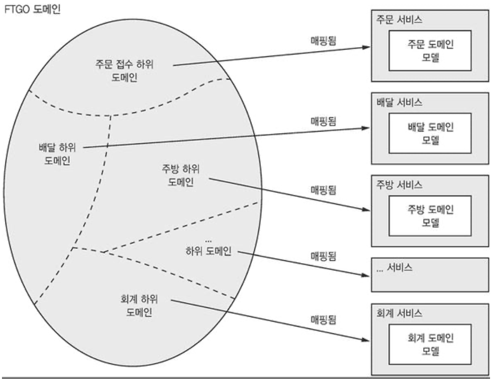

DDD 와 MSA 는 거의 찰떡궁합이다.  
DDD 의 하위 도메인, 경계 컨텍스트 개념은 마이크로 서비스 아키텍처의 서비스와 잘 맞고, 마이크로 서비스 아키텍처의 서비스 자율팀 개념은 도메인 모델을 개별 팀이 소유/개발 한다는 DDD 사고 방식과 어울린다.  
자체 도메인 모델을 가진 하위 도메인이라는 개념 덕분에 만능 클래스를 제거하고 서비스로 분해하기가 더 수월해진다.  

## 분해 지침

비즈니스 능력에 따른 분해, 하위 도메인에 따른 분해는 MSA 를 정의하는 주요 수단이다.  
로버트 C 마틴이 주장한 객체 지향 설계에 근거한 두가지 원칙이 있다.  
클래스의 책임을 정의하는 단일책임원칙 (SRP) 과 클래스를 패키지로 구성하는 공동 폐쇄 원칙 (Common Closure Principal) 이다.  
MSA에 이 두가지 원칙을 어떻게 적용할 수 있는지 살펴보자.

### SRP

> 클래스는 오직 하나의 변경 사유를 가져야 한다.
 
 클래스가 맡은 책임은 각각 그 클래스가 변경될 잠재적 사유인데, 클래스가 독립적으로 변경 가능한 책임을 여럿 짊어지고 있다면 안정적일 수 없다.  
 이 원칙을 MSA 에 적용하면 하나의 책임만 가진 작고 응집된 서비스를 정의할 수 있다.  
 주문 접수부터, 준비, 배달에 이르기 까지 소비자가 주문한 음식이 배달되는 과정 하나하나 모두 개별 서비스가 맡아 처리한다.  
 
### CCP

> 패키지의 클래스들은 동일한 유형의 변경에 대해 닫혀 있어야 한다. 패키지에 영향을 주는 변경은 그 패키지에 속한 모든 클래스에 영향을 끼친다.  
 
즉, 어떤 두 클래스가 동일한 사유로 맞물려 변경되면 동일한 패키지에 있어야 한다는 것이다.  
비즈니스 규칙이 나중에 바뀌어도 개발자는 가급적 소수(이상 : 1개)의 패키지에 있는 코드만 고치면 되게 만들자는 것.  
유지 보수성의 향상을 불러 일으킨다.  

## 서비스 분해의 장애물

1. 네트워크 지연
2. 동기 통신으로 인한 가용성 저하
3. 여러 서비스에 걸쳐 데이터 일관성 유지
4. 데이터의 일관된 뷰 확보
5. 분해를 저하하는 만능클래스